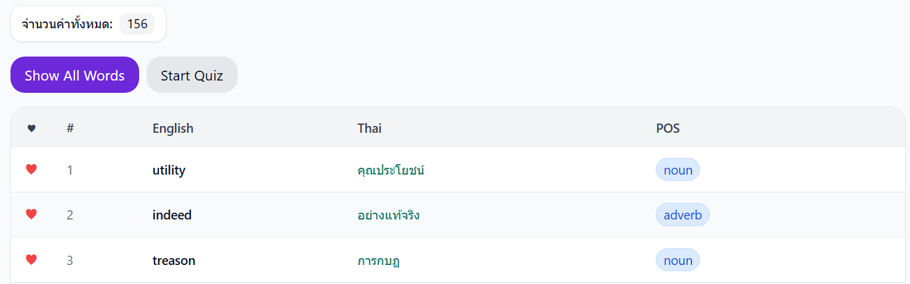

Mobile App CP213

Practice English Vocab (เหมือนคำศัพท์ Flashcard)

ฝึกภาษาอะไรก็ได้
สามารถแบ่ง set หมวดหมู่ได้ เช่น คำศัพท์อังกฤษ, คำศัพท์ญี่ปุ่น, คำศัพท์อังกฤษประเภทอาหาร, คำศัพท์อังกฤษประเภทการเงิน

Features
- ให้ user Input คำศัพท์ที่ตัวเองอยากรู้ได้(มี starter pack ให้)
- Delete คำศัพท์, Deleteหมวดหมู่คำศัพท์, Add คำศัพท์, Add หมวดหมู่คำศัพท์, Edit คำศัพท์, Edit หมวดหมู่คำศัพท์
- มี Quiz ให้ User สามารถเล่นได้ โดยจะสุ่มคำศัพท์ที่มีอยู่ในคลังที่ Input ไป จะสุ่มและมีปุ่มกด Back, Reveal, Next คำศัพท์จะสุ่มทุกครั้งที่เริ่ม Quiz ใหม่
- Sorted คำศัพท์ได้ เช่น ตามลำดับที่ add, A-Z
- ปุ่ม Shuffle คำศัพท์
- สามารถกด Favorite คำศัพท์ได้
- คำที่ Favorite จะอยู่ด้านบนสุดเสมอ ตอน Quiz ก็จะบอกว่า คำๆนี้เรา Favorite ไว้

  

Input Word
- คำศัพท์,Part-of-Speech (POS)(optional),คำแปล

UI/UX
เข้า app จะเป็นหน้า All Words และมีปุ่มให้ switch ระหว่าง หน้าคำศัพท์และ Quiz

optional
- กดคำศัพท์แล้วจะเข้าไป searh คำๆนั้นใน Dictionary