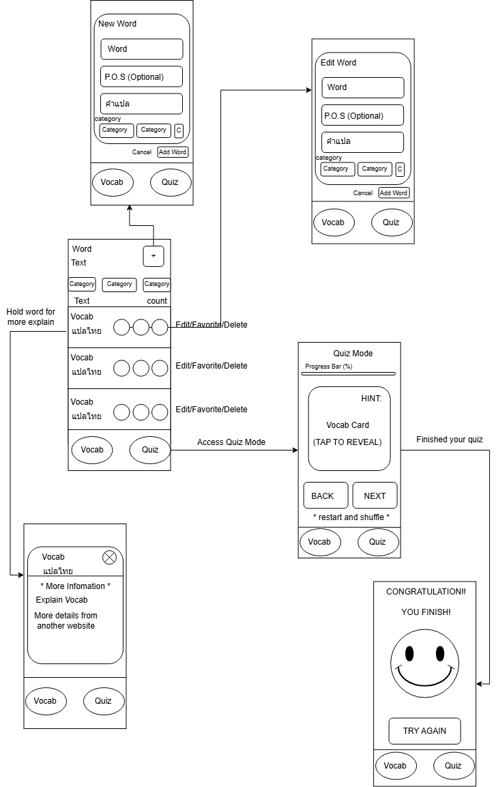

## 📱 Application Flow & Wireframe

ภาพรวมการทำงานของแอปพลิเคชัน CP213 Practice English Vocab ออกแบบมาเพื่อให้ผู้ใช้สามารถจัดการคำศัพท์และทดสอบความจำได้อย่างต่อเนื่องใน Flow เดียว:

  

> ✏️ *สามารถดูหรือแก้ไขไฟล์ต้นฉบับได้ที่: [app-flow.drawio](docs/Flow-app.drawio) (เปิดด้วย draw.io)*

### 📌 User Journey & Features
จากแผนภาพด้านบน ผู้ใช้สามารถใช้งานฟังก์ชันหลักๆ ได้ดังนี้:

1. **Vocab Management (หน้าหลัก):**
   * แสดงรายการคำศัพท์ทั้งหมด พร้อมแบ่งตามหมวดหมู่ (Category)
   * สามารถกดปุ่ม `+` เพื่อเข้าสู่หน้า **New Word** สำหรับเพิ่มคำศัพท์ใหม่ (ระบุคำ, Part of Speech, คำแปล และหมวดหมู่)
   * สามารถกดปุ่ม Edit ที่รายการคำศัพท์ เพื่อเข้าสู่หน้า **Edit Word**
   * *Long Press (กดค้าง):* ที่คำศัพท์เพื่อดูข้อมูลและคำอธิบายเพิ่มเติม (More Details)

2. **Quiz Mode (โหมดทดสอบ):**
   * เข้าถึงได้จากแท็บเมนู `Quiz` ด้านล่าง
   * แสดงการ์ดคำศัพท์แบบ Flashcard (Tap to Reveal) เพื่อดูคำใบ้หรือคำแปล
   * มี Progress Bar แสดงความคืบหน้าของการทำแบบทดสอบ
   * เมื่อทำเสร็จสิ้น จะเข้าสู่หน้า **Congratulation** พร้อมสรุปผล และมีตัวเลือกให้กด `Try Again` เพื่อเริ่มทำใหม่
